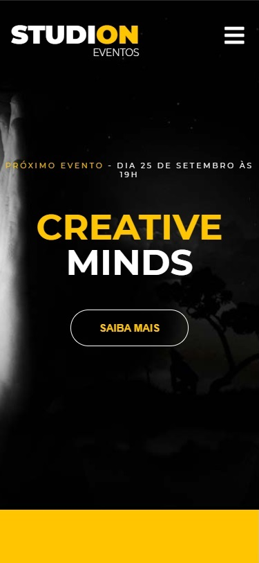
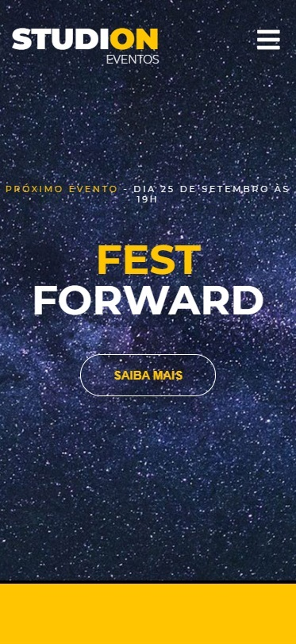

<h1>Studion Event</h1>

The project was developed to study HTML, CSS, JS and learn to use Bash and GitHub, among other technologies.

 
 

**Initial - Desktop**

<table>
  <th>Carousel</th>
  <th>Carousel</th>
  <th>Carousel</th>
  
<tr>
<td>
  
</td>
<td>
  
</td>
<td>
   
</td>
</tr>
</table>

**Continuation**

<table>
<th>Middle</th>
<th>End</th>
<tr>
<td>
  
</td>
<td>
  
</td>
</tr>
</table>

**Contact Page**
<table>
<th>Initial</th>
<th>Middle</th>
<th>End</th>
<tr>
<td>
  
</td>
<td>
  
</td>
  <td>
  
</td>
</tr>
</table>

 
 

**Initial - Mobile**

<table>
  <th>Carousel</th>
  <th>Carousel</th>
  <th>Carousel</th>
  
<tr>
<td>
  
</td>
<td>
  
</td>
<td>
   
</td>
</tr>
</table>

**Continuation**

<table>
  <th>Middle</th>
  <th>Middle</th>
  <th>End</th>
  <th>End</th>
  
<tr>
<td>
  
</td>
<td>
  
</td>
<td>
  
</td>
<td>
  
</td>
</tr>
</table>

<h2>Getting Started</h2>
<pre>
<code>-git clone https://github.com/SetropLeo/StudionEvent
</code>
</pre>

<h2>Built With</h2>
<ul>
<li>HTML5</li>
<li>CSS3</li>
<li>JavaScript</li>
<li>JQuery</li>
</ul>

<h2>Contributions</h2>
<a href="W3Schools">https://w3schools.com/</a> 
 
<a href="Imagine School">https://imagineschool.com.br/</a>

